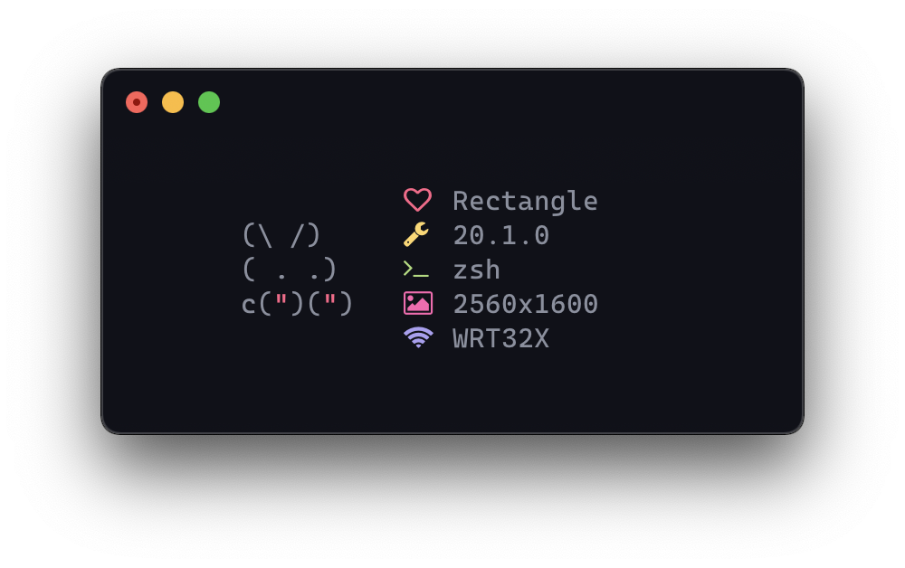

# cutefetch
> 🐰 macOS version of [elenapan's bunnyfetch](https://github.com/elenapan/dotfiles/blob/master/bin/bunnyfetch).

## Dependencies
- A [Nerd Fonts](https://github.com/ryanoasis/nerd-fonts) patched font.
- [Typicons](https://www.s-ings.com/typicons/)

## Installation
1. clone the repo
2. move the `cutefetch` script to a directory in `$PATH`

## Usage
```sh
$ cutefetch
```
<center></center>

## License
[MIT](LICENSE)
